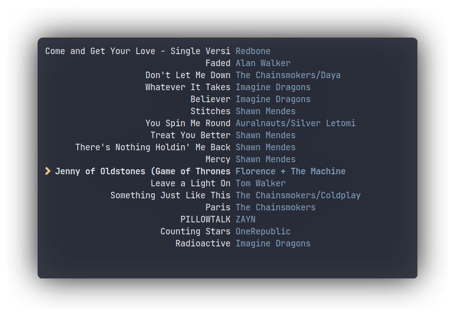

# Music Client 

### Showcase


### Info

Thật ra nó chỉ là 1 cái app `tui` nghe nhạc là [`ncmpcpp`]() trên Linux thôi. Nhưng với Awesomewm, bạn có thể thêm các widget vào các app có class xác định.

Mình set music client của riêng mình bằng cmd như sau:

```bash
music_client = "st -c music -e ncmpcpp",
```
Mình dùng terminal emulator mặc định là `st`, cmd có nghĩa `st` run command `ncmpcpp` và set class là `music`, giờ chỉ cần tạo các widget bằng lua api của Awesomewm và khởi động cùng các app có class `music`.

Nếu chỉ bật `ncmpcpp` riêng thì chỉ có thế này thôi. 




