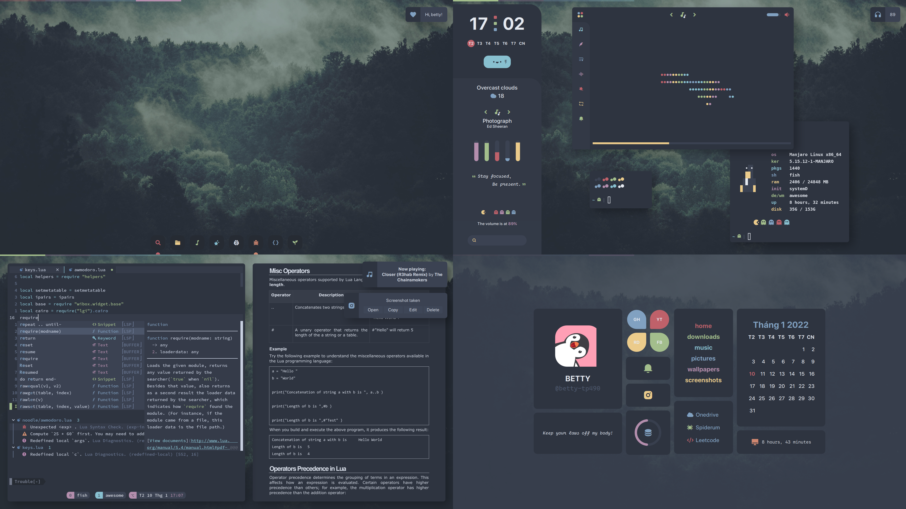

# 🐧🐧🐧 Hmmmm

### 🚧 Details

---

* [bspwm](https://github.com/baskerville/bspwm) and [awesomeWM](https://github.com/awesomeWM/awesome): tiling window manager (now I'm use awesome)
* [kitty](https://github.com/kovidgoyal/kitty): terminal emulator 
* [fish](https://fishshell.com/): smart and user-friendly command line
shell
* [neovim](https://github.com/neovim/neovim): text editor
* [polybar](https://github.com/polybar/polybar): status bar
* [rofi](https://github.com/davatorium/rofi): Launch apps
* [nitrogen](https://aur.archlinux.org/packages/nitrogen-git/): For background
* [picom-jonaburg-git](https://github.com/jonaburg/picom): A lightweight compositor for X11
* [dunst](https://github.com/dunst-project/dunst): Lightweight and customizable notification daemon
* [eww](https://github.com/elkowar/eww): ElKowars wacky widgets 

---

## :hugs: :hugs: And special thanks to:
* [Elenapan](https://github.com/elenapan/dotfiles) for awesomeWM's config. 
* [Thanhvule0310](https://github.com/thanhvule0310/dotfiles) for bspwm, neovim, polybar,... I'm newbie to Linux and his dotfiles help me so lot.
* [Adi1090x](https://github.com/adi1090x/widgets) for EWW widget.
